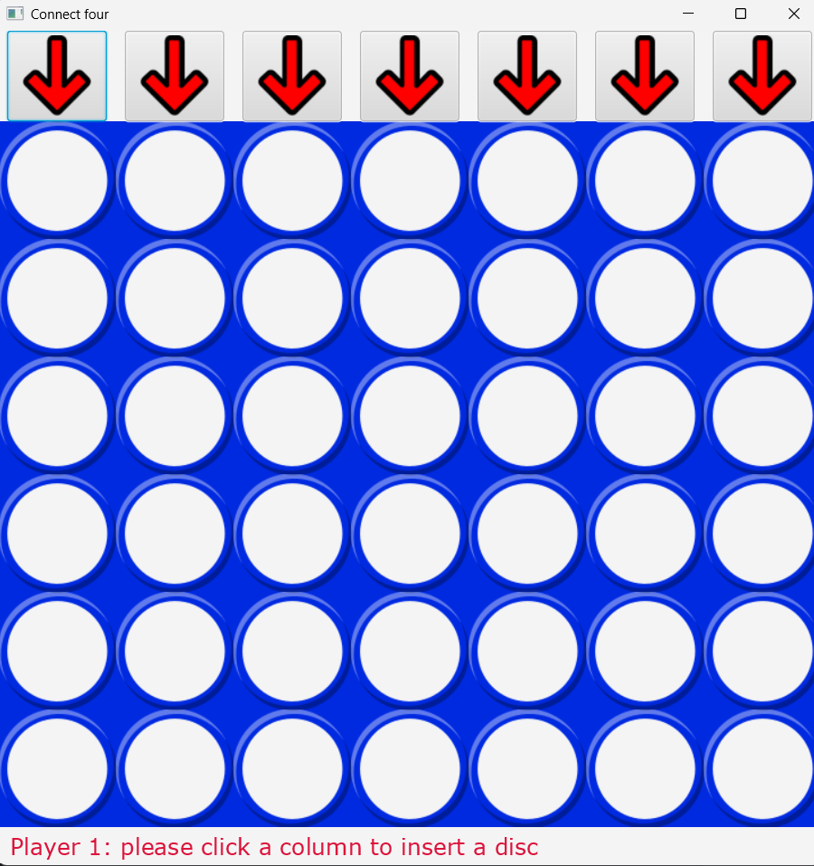

# Puissance 4
Puissance 4 est un jeu de société, qui a était développé lors du 2ème semestre de la L2 EEEA à l'UFR Sciences et Techniques du Madrillet.
Nous avons passé tout le semestre à développer nos compétences dans le langage Java, ce jeu de plateau était la concrétisation de nos TPs, il apparaissait donc comme un TP, on avait 12h pour finaliser ce projet, qui était guidé. L'objectif était de le programmer toutes les fonctionnalités du jeu, le mode graphique est donné par notre professeur.
## Prérequis
- Java 17+
- Maven 3.8+
## Installation et lancement

# Cloner le repo
git clone https://github.com/TON_USERNAME/puissance4

# Se placer dans le dossier
cd puissance4

# Compiler et lancer
mvn javafx:run
## Technologies
- Langage : Java
- Compilation : GCC
- Interface : Framework JavaFX

## Fonctionnalités
- Deux joueurs en local
- Voir règles de jeu sur mon portfolio

## Aperçu

